class: inverse

```{r setup, include=FALSE}
options(htmltools.dir.version = FALSE)
knitr::opts_chunk$set(
  message = FALSE, 	warning = FALSE, comment = "",
  echo = FALSE, fig.align='center'
)

library(tidyverse)
library(DT)
Data <- readRDS("data/Data.rds")
Data$location <- factor(Data$location,
                        levels = c("county", "special municipality", "offshore island"),
                        labels = c("county", "municipality", "island"))
LM_data <- Data %>% 
  mutate(agree = agree_rate, 
         vote = vote_rate,
         municipality = as.numeric(as.character(is_municipality)),
         offshoreIsland = as.numeric(as.character(is_offshoreIsland)),
         gender = gender_ratio,
         age = age_med, 
         married = married_ratio,
         college = college_ratio,
         salary = salary_med)
rownames(LM_data) <- rownames(data)
source("custom_function.R")
```


# QR-code 

Link: <https://bit.ly/3aHVNgv>

```{r, out.width="60%"}

```

---
class: inverse, center, middle

# Outline
.Large[
前言與研究目的

文獻回顧

資料來源與前處理

二項式迴歸模型

加權最小平方估計之多元迴歸模型

結果與討論
]

---
class: inverse, center, middle

# Outline
.Large[
.lightPink[前言與研究目的]

文獻回顧

資料來源與前處理

二項式迴歸模型

加權最小平方估計之多元迴歸模型

結果與討論
]

---

# 前言

2018年11月24日中華民國全國性公民投票結果

```{r, out.width="90%"}
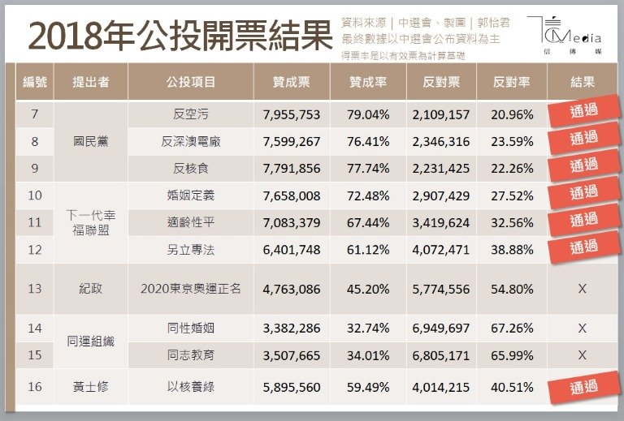
```

---

# 性平公投 vs. 愛家公投 

.pull-left[
```{r, out.width="100%"}
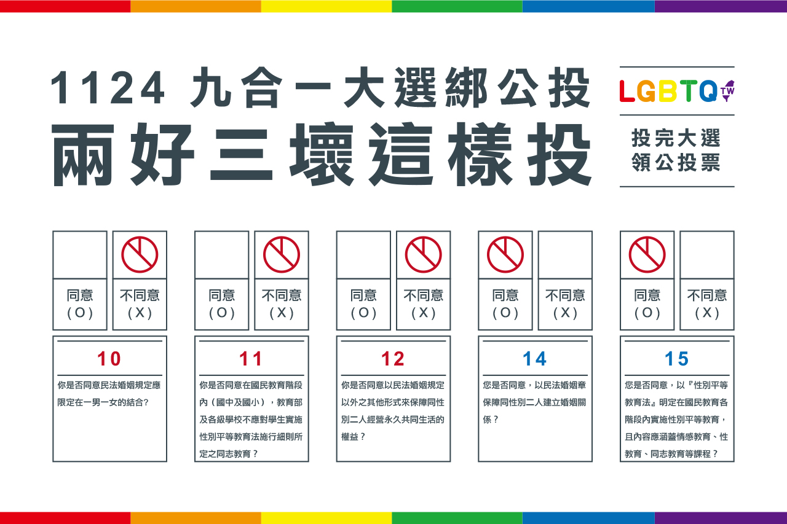
```
]

--

.pull-right[
```{r, out.width="100%"}
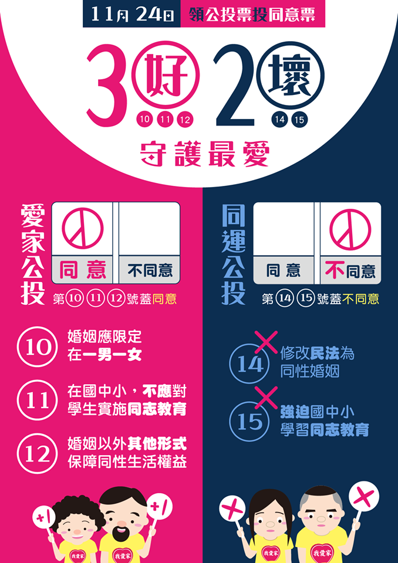
```
]

---

# 探討對象

.scroll-output[
```{r, out.width="60%"}
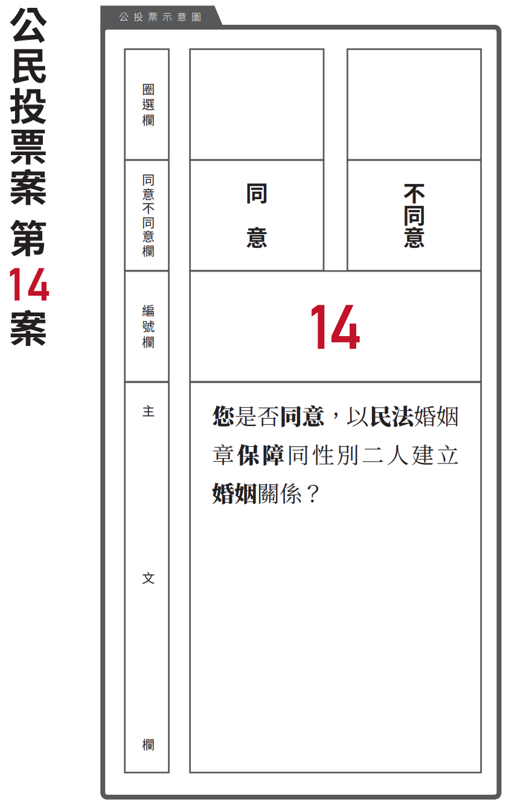
```
]


---
class: inverse, center, middle

# Outline

.Large[
前言與研究目的

.lightPink[文獻回顧]

資料來源與前處理

二項式迴歸模型

加權最小平方估計之多元迴歸模型

結果與討論
]


---

# 同性戀態度

### 負面 / 恐同可能因素
- 年齡較大、男性 > 女性、較少接觸到高等教育、鄉下或小城鎮<br />  .cite[(Herk, 1984)]
- 結過婚的 .cite[(Seltzer, 1992)]
- 家中成員多 .cite[(Adamczyk & Pitt, 2009)]
- 收入較低者 .cite[(West & Cowell, 2013)]
- 大學教育以上的中年人比起老年人與年輕人較有正面態度<br /> .cite[(Seltzer, 1992)]
- 青少年與大學年齡的男性比中年人更可能持強烈的否定立場<br /> .cite[(王晴峰, 2013)]

--

### 並非所有研究都相同
- 年齡大者反而負面態度較小 .cite[(West & Cowell,2013)]
- 性別差異不顯著 .cite[(Bowman, 1979; Glenn & Weaver,1979)]
- 與收入高低無關 .cite[(Gelbal & Duyan 2006; Becker & Scheufele, 2009)]

---

# 同性戀態度

### 其他可能因子  
- 對 79 國的同性戀態度進行多元迴歸分析，其中包含:宗較、年紀、家中小孩人數、有無結婚、收入、教育狀態...等都有顯著影響。其中特別是.tomato[宗教信仰]最能影響同性戀態度的取向 .cite[(Jäckle & Wenzelburger, 2015)]

- 透過後設分析，將主要影響各國同性戀態度的原因歸類至.tomato[經濟、民主、宗教]三個主要因子 .cite[(Adamczyk & Liao, 2019)]

--

總結來說，可能的影響因子：  
- __年齡、性別、區域(都市/鄉下)、婚姻狀況、教育程度、經濟收入、種族、民主、宗教__...等
- 以及變項間的交互作用
- 雖然有許多變項會影響同性戀態度，但受限於資料的取得 (如：台灣並無宗教信仰普查)，故期望後續研究得以加入。

---
class: inverse, center, middle

# Outline

.Large[
前言與研究目的

文獻回顧

.lightPink[資料來源與前處理]

二項式迴歸模型

加權最小平方估計之多元迴歸模型

結果與討論
]

---


# 資料來源
- 公投：
    + [政府資料開放平臺_第14案全國性公民投票計票結果](https://data.gov.tw/dataset/95883)
    
- 人口年齡組成：
    + [內政資料開放平臺_村里戶數、單一年齡人口（新增區域代碼）](https://bit.ly/30DWL5J)
    
- 結婚與教育：
    + [內政資料開放平臺_15歲以上現住人口按性別、年齡、婚姻狀況及教育程度分](https://bit.ly/2QdqGgk)
    
- 薪水中位數：
    + [財政部財政資訊中心_105年度綜合所得稅申報核定統計專冊](https://bit.ly/2M3IiwY)

--

<hr />

**資料數量**：全台鄉、鎮、市、區共 368 個  
**反應變項**：公投第 14 案同意率  
**預測變項**：投票率、地區、性別比、年齡、婚姻、教育程度、薪水收入


---

# 變數介紹

- $\bar{y}$: Agree_rate 第14案公投同意率 
- X1: Vote_rate 投票率  
- X2: Location 地理位置 (類別變項：直轄市、一般縣市、離島)
  - X21:Municipality $=\begin{cases}1, \text{直轄市}\\0,\,非直轄市\end{cases}$ 

  - X22:Island $=\begin{cases}1, 離島\\0,\,非離島\end{cases}$
- X3: Gender_ratio 性別比  
- X4: Age_med 年齡中位數  
- X5: Married_ratio 結過婚比例  
- X6: College_ratio 教育程度 (大專生畢業比例)  
- X7: Salary_med 薪水中位數 (千元)  

---

# 資料地圖 [(連結)](https://xup6y3ul6.github.io/ALSM_final_report/referendum14_map.html#1)

```{r, out.width="60%"}
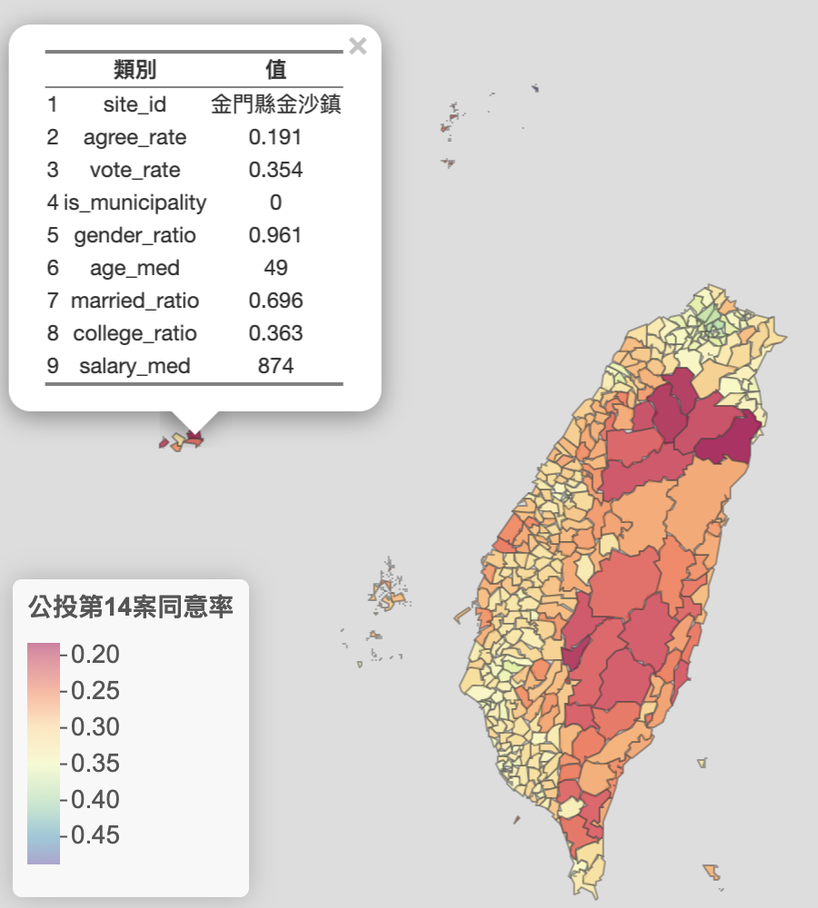
```

---

# 公投第 14 案同意率

.pull-left_30[.middle[
$同意率 = \frac{同意票數}{有效票數}$

|Stat.|Value|
|--|--:|
|Min.|0.184|
|Q1|0.277|
|Med.|0.305|
|Mean|0.301|
|Q3|0.326|
|Max.|0.487|
|Std.|0.040|

]]

.pull-right_70[
```{r}
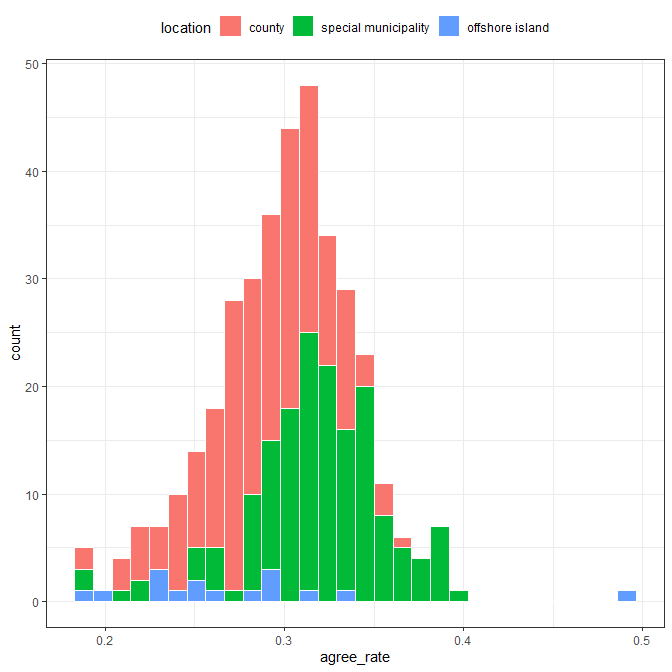
```
]

---

# 投票率
.pull-left_30[.center[
$投票率 = \frac{投票數}{可投票人數}$

|Stat.|Value|
|--|--:|
|Min.|0.291|
|Q1|0.505|
|Med.|0.542|
|Mean|0.534|
|Q3|0.577|
|Max.|0.689|
|Std.|0.060|

]]

.pull-right_70[
```{r}
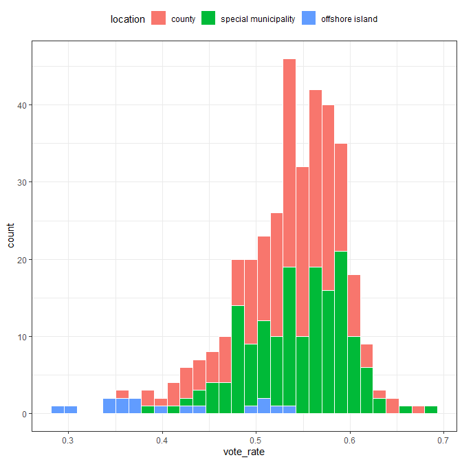
```
]

---

# 地理位置

.pull-left_30[.middle[
<span style='color:#F8766D;'>一般縣市</span>：194 個

<span style='color:#00BA38;'>直轄市</span>：158 個

<span style='color:#619CFF;'>離島</span>：16 個

]]

.pull-right_70[
```{r}
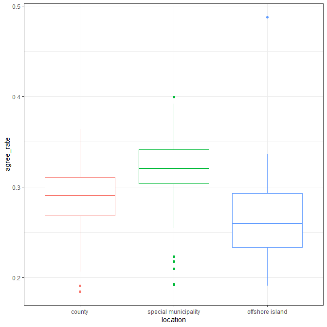
```
]

---

# 性別比

.pull-left_30[
$性別比 = \frac{男性人數}{女性人數}$

|Stat.|Value|
|--|--:|
|Min.|0.833|
|Q1|0.986|
|Med.|1.047|
|Mean|1.053|
|Q3|1.118|
|Max.|1.582|
|Std.|0.102|

]

.pull-right_70[
```{r}
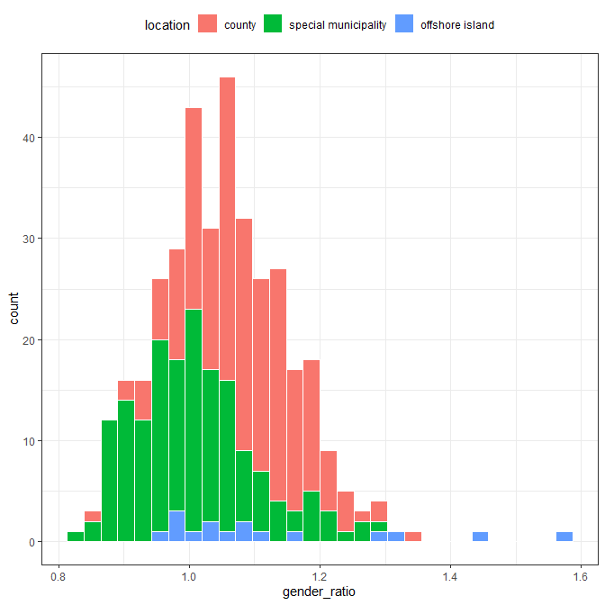
```
]

---

# 年齡中位數

.pull-left_30[

|Stat.|Value|
|--|--:|
|Min.|40.000|
|Q1|45.000|
|Med.|47.000|
|Mean|47.394|
|Q3|50.000|
|Max.|55.000|
|Std.|2.978|

]

.pull-right_70[
```{r}
knitr::include_graphics("figures/age_med.png")
```
]

---

# 結婚率

.pull-left_30[
$結婚率\\=\frac{有偶+喪偶+離婚}{總人數}$

|Stat.|Value|
|--|--|
|Min.|0.590|
|Q1|0.652|
|Med.|0.666|
|Mean|0.668|
|Q3|0.683|
|Max.|0.753|
|Std.|0.025|

]

.pull-right_70[
```{r}
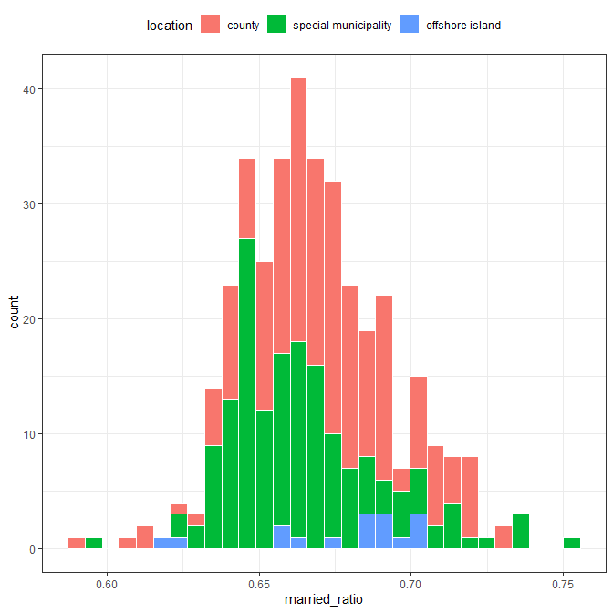
```
]

---

# 大學教育程度

.pull-left_30[
$大專畢業率\\=\frac{大學+大專+碩士+博士}{總人數}$

|Stat.|Value|
|--|--:|
|Min.|0.117|
|Q1|0.214|
|Med.|0.275|
|Mean|0.290|
|Q3|0.356|
|Max.|0.653|
|Std.|0.101|

]

.pull-right_70[
```{r}
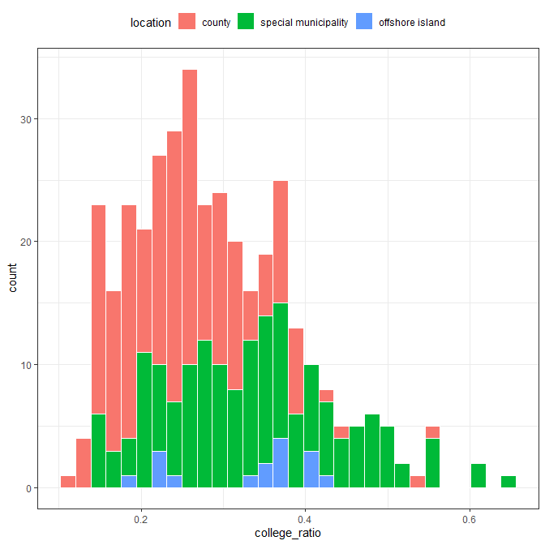
```
]

---

# 薪水中位數

.pull-left_30[

|Stat.|Value|
|--|--:|
|Min|587.0|
|Q1|691.0|
|Median|735.0|
|Mean|784.9|
|Q3|823.2|
|Max|1722.0|
|Std|162.8|

]

.pull-right_70[
```{r}
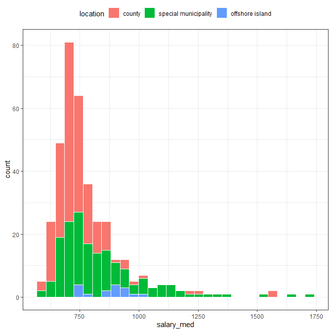
```
]

---

# Scatter-correlation matrix

```{r, out.width="70%"}
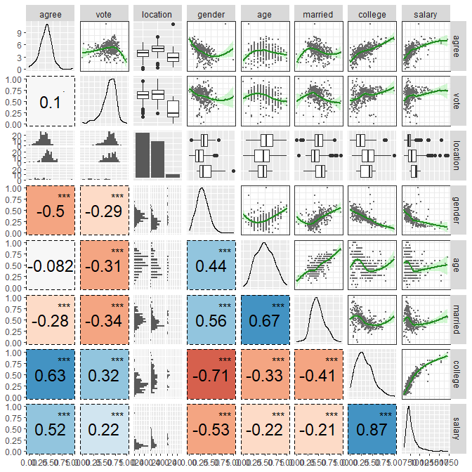
```

---
class: inverse, center, middle

# Outline

.Large[
前言與研究目的

文獻回顧

資料來源與前處理

.lightPink[二項式迴歸模型]

加權最小平方估計之多元迴歸模型

結果與討論
]

---

# 分析流程

```{r, out.width="65%"}

```

---

# Binomial regression model


Let 

- $\bar{y_i}$ be the observed agree_rate in the $i$th 鄉鎮市區
- $N_i$ be the number of the valid vote in the $i$th 鄉鎮市區
- $\pi_i$ be the probability of agree.

--

Our preliminary model is

$$
\begin{align}
N_i\bar{y}_i \sim Binomial(N_i, \pi_i) \\
\pi_i = g^{-1}(\eta_i) = g^{-1}(\boldsymbol{x_i^\top\beta})
\end{align}
$$

where $i = 1, \dots, 368$,  $\boldsymbol{x_i} = (x_{i1}, ..., x_{i7})$ and $g(\cdot)$ is a link function.

--

- identity link
- logit link
- probit link
- cloglog linnk

---

# Binomial regression model

考慮所有變項的都加入下，.tomato[identity link] 表現比較好

```{r}
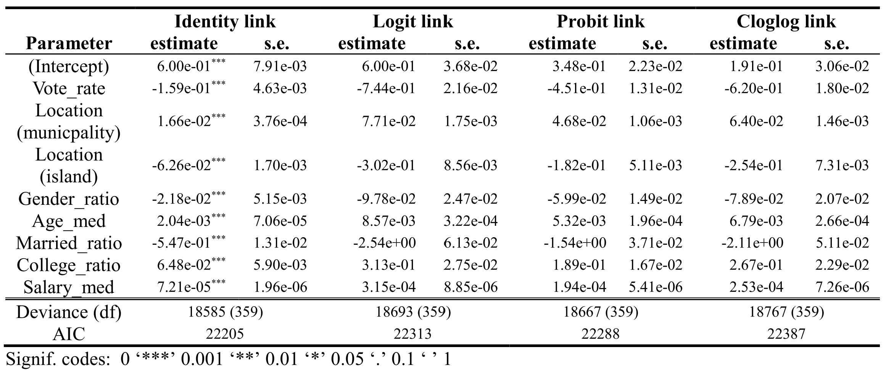
```

---

# True value $\bar{y}$ vs. Fitted value $\hat{\pi}$

```{r, out.width="70%"}
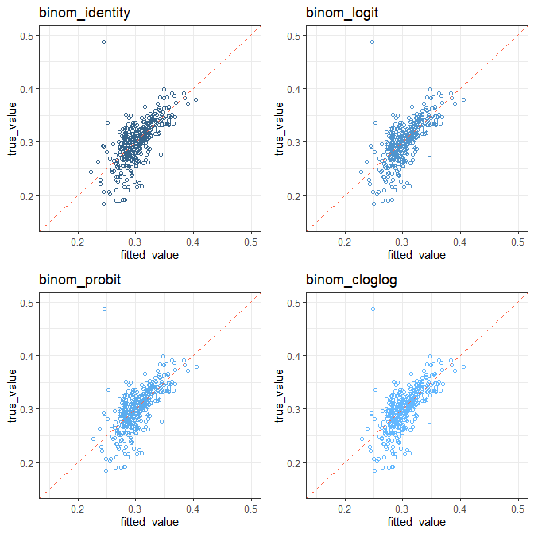
```

---

# True value $\bar{y}$ vs. $\hat{\eta} = X\hat\beta$

```{r, out.width="70%"}
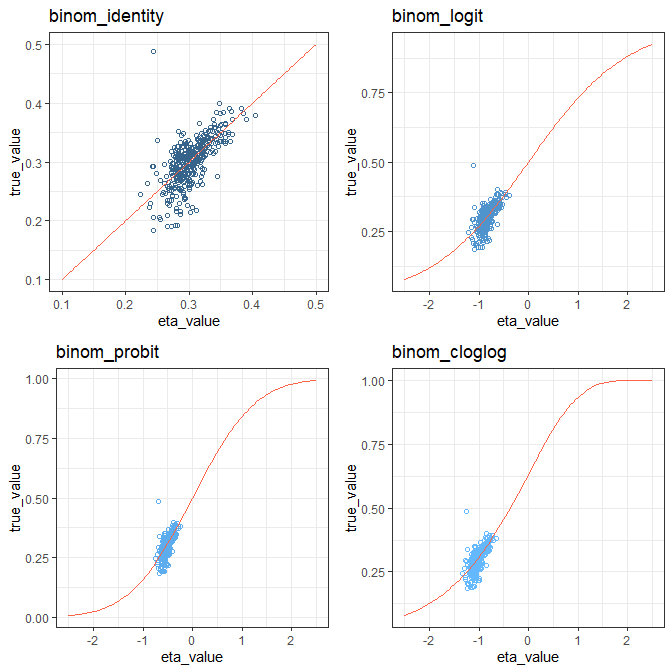
```

---

# Standardized residual plot

```{r, out.width="70%"}
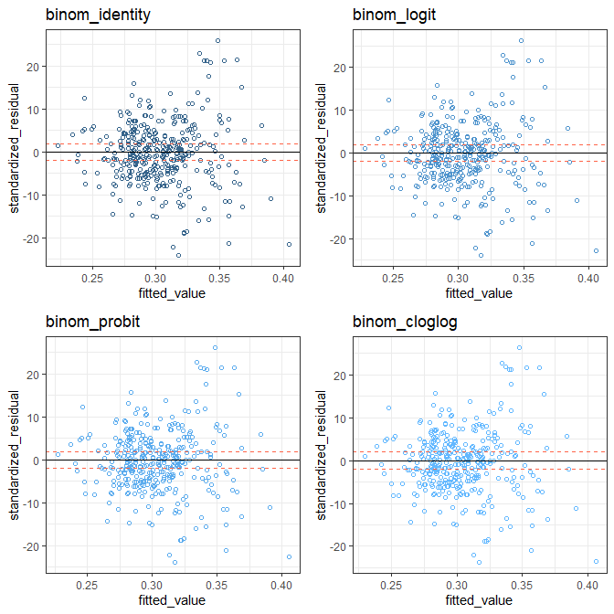
```

---

# Partial residual plot

```{r, out.width="70%"}
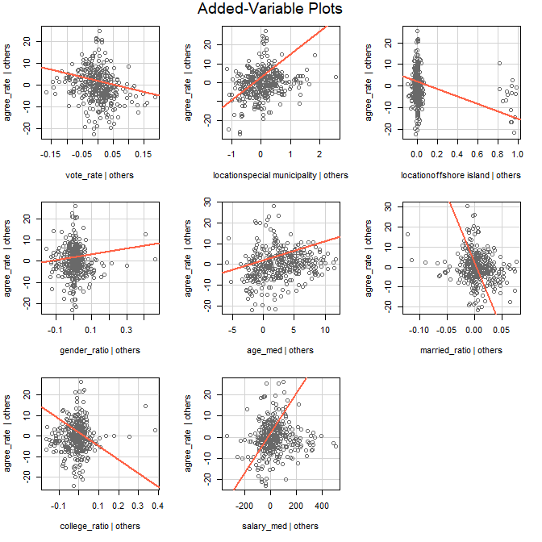
```

---

# Model selection

考慮原始.blue[兩兩變項間之交互作用項]加入於原始模型中，但不考慮高次項

--

.blue[R 原生套件中的函式 `step()`] 來執行逐步迴歸 .cite[(R Core Team, 2020)]

- AIC、BIC 兩種準則
- 前向、反向、雙向選擇

找出六個候選模型 (有可能會找出相同模型)，但其缺點在於它並不會搜尋完所有的子模型

--

.blue[glmulti 套件的函式 `glmulti()`] 來搜尋前幾佳的 GLM .cite[(Calcagno, 2020)]
- AIC、BIC 兩種準則

再找出六個候選模型

---

# Model selection

```{r, out.width="80%"}
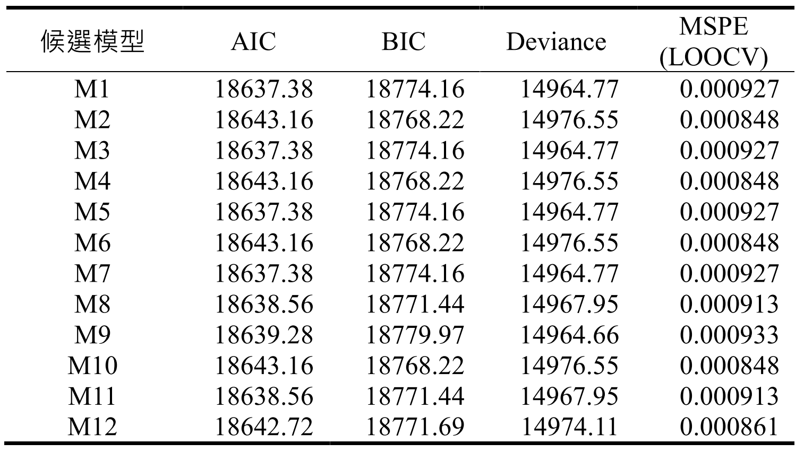
```

選擇基準：

- AIC、BIC、MSPE (LOOCV) 較小者
- 若兩變項之交互作用存在時其相對應的主要效果也應在模型之中

偏好 **M2** 作為暫時的最佳模型

---

# The temporal best model: M2


.scroll-output[
```{r}
.f_M2 <- agree ~ college + location + vote + married + 
    salary + age + gender + location:married + 
    college:location + location:salary + college:married + 
    college:salary + vote:age + location:age + 
    married:age + salary:age + location:gender + 
    married:salary + college:gender + vote:married + 
    vote:gender + vote:salary + college:vote + 
    age:gender + married:gender

M2 <- glm(formula = .f_M2, data = LM_data, weights = valid_vote,
          family = binomial(link = "identity"))
summary(M2)
```

幾乎所有的參數 $\beta$ 都顯著，然而卻可以發現有蠻大的.tomato[過度離散]現象產生
( $\hat{\phi}_p=44.52,\;\hat{\phi}_D=44.57$ )
]

---

# Overdispersion model

.scroll-output[
```{r}
quasi_M2 <- update(M2, family = quasibinomial(link = "identity"))
summary(quasi_M2)
```

結果幾乎所有 $\beta$ 都變不太顯著了，.tomato[s.e. 太大了]！
]

---

# 兩難

1. 如果我不用 quasi-binomial regression 去擬合的話，M2 還是會有很大的過度離散現象存在

2. 如果我選擇用 quasi likelihood 的做法，我便沒法使用 AIC、BIC 來做模型的選擇 <br />
.gray[(但似乎可以用 QAIC)]

--

我後來想到我既然都是使用 identity function 作為鏈結函數的選擇，.tomato[那何不直接使用一般線性模型 (general linear model) 來估計同意率 (𝜋) 呢？]

---
class: inverse, center, middle

# Outline

.Large[
前言與研究目的

文獻回顧

資料來源與前處理

二項式迴歸模型

.lightPink[加權最小平方估計之多元迴歸模型]

結果與討論
]

---

# 考慮直接做多元迴歸

$$
\begin{align}
&\bar{y}_i = \boldsymbol{x_i^{\top}\beta} + \varepsilon_i \\
&\varepsilon_i \overset{i.i.d.}{\sim} N(0, \sigma^2)
\end{align}
$$

--

但這會有點怪怪的是

- 每個的資料點 (鄉鎮地區) 的權重都相同，沒有考量到投票人數
- 例如：同樣是同意率為 0.366 
  - 臺北市文山區 (有效票數為 47668 票) vs.
  - 臺南市官田區 (有效票數為 3074 票) 
- 變異數不符合同質性假設


---

# <span style="font-size:38pt">Weighted least square estimation</span>

$$
N_i\bar{y}_i \sim Binomial(N_i, \pi_i)
$$

- $E[\bar{y}_i | X] = \pi_i = \boldsymbol{x_i^{\top}\beta}$
- $Var[\bar{y}_i | X] =  \frac{\pi_i(1-\pi_i)}{N_i}$

--
.tomato[
$$
\begin{align}
&\bar{y}_i = \boldsymbol{x_i^{\top}\beta} + \varepsilon_i \\
&\varepsilon_i \overset{i.i.d.}{\sim} Normal(0, \frac{\pi_i(1-\pi_i)}{N_i})
\end{align}
$$
]

- 變異數不同質
- 加權最小平方估計，其中權重為 $\frac{N_i}{\pi_i(1-\pi_i)}$

--

.blue[結果發現其實與用 quasi-binomial regression (with identity link) 的參數估計是相同的！]

---

# <span style="font-size:38pt">Weighted least square estimation</span>

.scroll-output[
```{r echo=TRUE}
.formula <- agree_rate ~ 1 + vote_rate + location + gender_ratio + age_med + married_ratio + college_ratio + salary_med

gauss_ident_w <- glm(formula = .formula, weights = valid_vote,
                     family = gaussian(link = "identity"), data = Data) 

.weight <- Data$valid_vote / (predict(gauss_ident_w)*(1-predict(gauss_ident_w)))
gauss_ident_w2 <- glm(formula = .formula, weights = .weight,
                      family = gaussian(link = "identity"), data = Data) 
summary(gauss_ident_w2)
```
]

---

# <span style="font-size:28pt">Quasi-binomial regression (with identity link)</span>

.scroll-output[
```{r echo=TRUE}
quasibinom_ident <- glm(formula = .formula, weight = valid_vote, 
                        family = quasibinomial(link = "identity"), data = Data)
summary(quasibinom_ident)
```
]

---

# AIC (likelihood) 怪怪的？

使用 weighted least square estimation 在 general linear regression 下的 AIC 為 .tomato[-1571.9]

但先前用 binomial regression (with identity link) 下的 AIC 大多為 .blue[18XXX] 以上

--

原因在於
- 前者的 likelihood 計算上是用 .tomato[normal distribution] 

$$
l(\boldsymbol{\beta}, \sigma) = \sum\ln\left((2\pi\sigma^2 )^{-\frac{1}{2}}exp(\frac{\bar{y}_i-\hat{\pi}_i(\boldsymbol{\beta})}{2\sigma^2})\right)
$$

- 而後者則是用 .blue[binomial distribution]

$$
l((\boldsymbol{\beta}) = \sum \ln\left( {N_i \choose N_i\bar{y_i}} [\hat{\pi}_i(\boldsymbol{\beta})]^{N_i\bar{y_i}} [1-\hat{\pi}_i(\boldsymbol{\beta})]^{N_i(1-\bar{y_i})}\right) 
$$

---

# Partial residual plot

```{r, out.width="70%"}

```

---

# Box-Cox transformation

```{r, out.width="70%"}
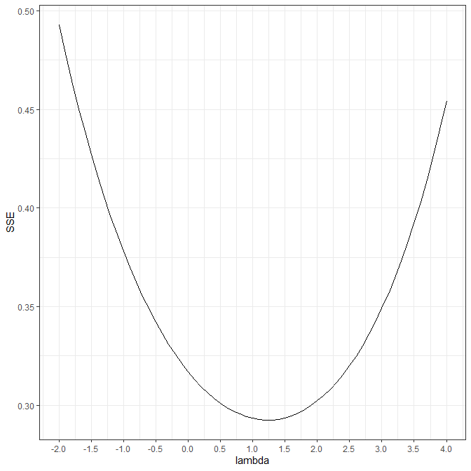
```

---

# Model selection

考慮原始.blue[兩兩變項間之交互作用項]加入於原始模型中，但不考慮高次項

--

.blue[R 原生套件中的函式 `step()`] 來執行逐步迴歸 .cite[(R Core Team, 2020)]

- AIC、BIC 兩種準則
- 前向、反向、雙向選擇

找出六個候選模型

--

.blue[leaps 套件的函式 `regsubsets()`] 來搜尋模型候選 .cite[(Lumley, 2020)] 

- adjust R2、Mallows’ CP、AIC、BIC、PRESS

再挑選了6個候選模型

---

# Model selection

```{r}
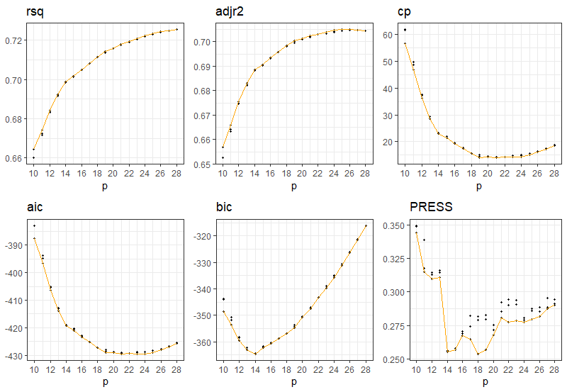
```

---

# Model selection

```{r}
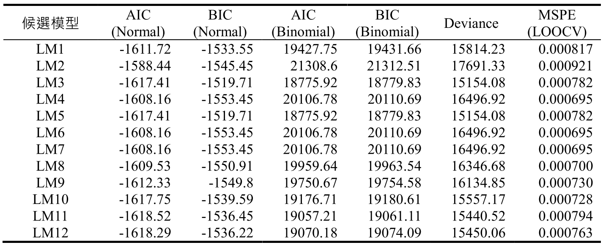
```

- AIC、BIC、MSPE (LOOCV) 較小者
- 若兩變項之交互作用存在時其相對應的主要效果也應在模型之中

偏好 **LM10** 作為暫時的最佳模型

---

# Final model: LM10

```{r}
.f2 <- agree ~ 1 + (vote + municipality + offshoreIsland + gender + age + married + college+ salary)^2

.weight <- LM_data$valid_vote / (predict(gauss_ident_w2)*(1-predict(gauss_ident_w2)))

gauss_all_w <-  glm(formula = .f2, weights = .weight,
                     gaussian(link = "identity"), data = LM_data)

.weight2 <- LM_data$valid_vote / (predict(gauss_all_w)*(1-predict(gauss_all_w)))

gauss_all_w2 <-  glm(formula = .f2, weights = .weight2,
                     gaussian(link = "identity"), data = LM_data)

.weight_all <- Data$valid_vote / (predict(gauss_all_w2)*(1-predict(gauss_all_w2)))

LM_data <- LM_data %>% 
  add_column(weighted = .weight_all)
```

.scroll-output[
```{r}
.f_LM10 <- agree ~ vote + municipality + offshoreIsland + gender + age + married + college + salary + municipality:age + municipality:married + municipality:college + municipality:salary + offshoreIsland:age +   offshoreIsland:college + gender:college + age:married + age:salary + married:college

LM10 <- glm(formula = .f_LM10, weights = weighted,
            family = gaussian(link = "identity"), data = LM_data)
summary(LM10)
```
]

---

# Residual and Q-Q plot

.pull-left[
```{r, out.width="100%"}
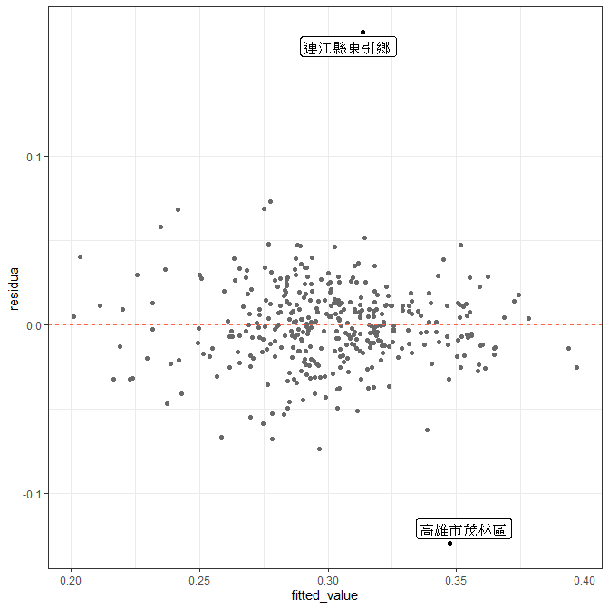
```
]

--

.pull-right[
```{r, out.width="100%"}
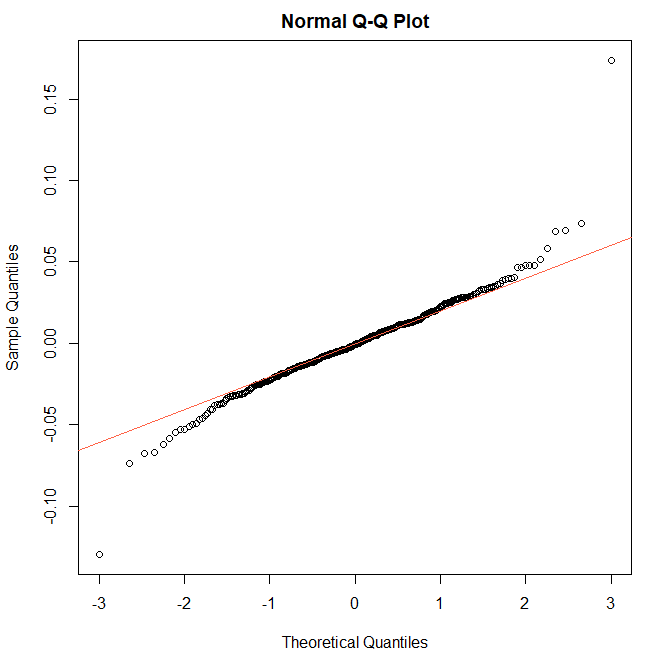
```
]


---

# Cook's distance

```{r, out.width="65%"}
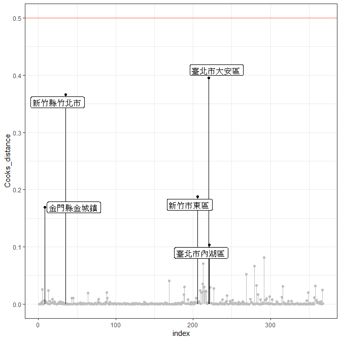
```

---

# Influence points

.small[
```{r}
influentialDF <- data.frame(
  "DFFITS"   = dffits(LM10) %>% round(digits = 3),
  "Cooks_D"  = cooks.distance(LM10) %>% round(digits = 3),
  "DFBETA"   = dfbeta(LM10) %>% round(digits = 3)
)

sketch <-  htmltools::withTags(table(
  class = 'display',
  thead(
    tr(
      th(rowspan = 2, ""),
      th(rowspan = 2, 'DFFITS'),
      th(rowspan = 2, 'Cooks_D'),
      th(colspan = ncol(dfbeta(LM10)), 'DFBETA')
    ),
    tr(
      lapply(paste0("b", 1:(ncol(dfbeta(LM10)))), th)
    )
  )
))
p <- LM10$coefficients %>% length()
n <- LM10$data %>% nrow()
DFFITS_critical <- 2*sqrt(p/n)
#CD_50 <- pf(0.5, p, n-p)
#CD_20 <- pf(0.2, p, n-p)
CD_0.5 <- 0.5
DFBETAS_critical <- 2/sqrt(n)

datatable(influentialDF,
          fillContainer = FALSE,
          container = sketch,
          extensions = 'FixedColumns',
          options = list(scrollX = TRUE,
                         fixedColumns = TRUE,
                         pageLength = 10,
                         autoWidth = TRUE,
                         columnDefs = list(list(width = '65px', targets = c(0)))
                         )) %>% 
  formatStyle(0:ncol(influentialDF), fontSize = "10pt") %>% 
  formatStyle("DFFITS",
              color = styleInterval(c(-DFFITS_critical, DFFITS_critical), c('red', 'black', 'red'))) %>% 
  formatStyle("Cooks_D",
              color = styleInterval(c(CD_0.5), c("black", "red"))) %>% 
  formatStyle(3:nrow(influentialDF),
              color = styleInterval(c(DFBETAS_critical), c("black", "red")))
```
]

---
class: inverse, center, middle

# Outline

.Large[
前言與研究目的

文獻回顧

資料來源與前處理

二項式迴歸模型

加權最小平方估計之多元迴歸模型

.lightPink[結果與討論]
]

---

# 最終模型

本研究就探討全台 368 個「鄉、鎮、市、區」為單位下，針對公投第14案，找出影響同意率的可能因素為何，最終得到的解釋性模型為：

.small[
$$
\begin{align}
&\left(Agree\_rate\right)=\hat{\pi}=\boldsymbol{X\hat{\beta}}\\ 
&\qquad =2.54-0.19\left(Vote\right)+0.46\left(Municipality\right)+1.06\left(Island\right)-0.28\left(Gender\right)\\
&\qquad -0.03\left(Age\right)-3.44\left(Married\right)-1.96\left(College\right)+3.33\ \times\ {10}^{-4}\left(Salary\right) \\
&\qquad + 2.41\times\ {10}^{-3}\left(Municipiality:Age\right)-0.90\left(Municipiality:Married\right) \\ 
&\qquad -0.12\left(Municipiality:College\right)+1.00\times\ {10}^{-4}\left(Municipiality:Salary\right) \\ 
&\qquad -0.02\left(Island:Age\right)-0.65\left(Island:College\right) +0.76\left(Gender:College\right) \\
&\qquad +0.06\left(Age:Married\right)-7.04\ \times\ {10}^{-6}\left(Age:Salary\right)+2.10(Married:College)
\end{align}
$$
]

---

# 最終模型

依照不同位置的類別：

- 一般縣市 $(Municipality=Island=0)$

.small[
$$
\begin{align}
\left(Agree\_rate\right) = 2.54-0.19\left(Vote\right)-0.28\left(Gender\right)-0.03\left(Age\right)-3.44\left(Married\right) \\ 
-1.96\left(College\right)+3.33\ \times\ {10}^{-4}\left(Salary\right)+0.76\left(Gender:College\right) \\ +0.06\left(Age:Married\right)-7.04\ \times\ {10}^{-6}\left(Age:Salary\right)+2.10(Married:College)
\end{align}
$$
]

- 直轄市 $(Municipality=1, Island=0)$

.small[
$$
\begin{align}
\left(Agree\_rate\right) = 3.00-0.19\left(Vote\right)-0.28\left(Gender\right)-0.029\left(Age\right)-4.34\left(Married\right) \\ 
-2.08\left(College\right)+4.33\ \times\ {10}^{-4}\left(Salary\right)+0.76\left(Gender:College\right) \\ +0.06\left(Age:Married\right)-7.04\ \times\ {10}^{-6}\left(Age:Salary\right)+2.10(Married:College)
\end{align}
$$
]

- 離島 $(Municipality=0, Island=1)$

.small[
$$
\begin{align}
\left(Agree\_rate\right) = 3.60-0.19\left(Vote\right)-0.28\left(Gender\right)-0.05\left(Age\right)-3.44\left(Married\right) \\
-2.61\left(College\right)+3.33\ \times\ {10}^{-4}\left(Salary\right)+0.76\left(Gender:College\right) \\ +0.06\left(Age:Married\right)-7.04\ \times\ {10}^{-6}\left(Age:Salary\right)+2.10(Married:College)
\end{align}
$$
]

---

# 模型解釋 (1/4)

.small[
$$
\begin{align}
&\left(Agree\_rate\right)=\hat{\pi}=\boldsymbol{X\hat{\beta}}\\ 
&\qquad =2.54\color{#ff6347}{-0.19\left(Vote\right)}\color{blue}{+0.46\left(Municipality\right)}\color{blue}{+1.06\left(Island\right)}\color{#ff6347}{-0.28\left(Gender\right)}\\
&\qquad \color{#ff6347}{-0.03\left(Age\right)-3.44\left(Married\right)-1.96\left(College\right)}\color{blue}{+3.33\ \times\ {10}^{-4}\left(Salary\right)} \\
&\qquad + 2.41\times\ {10}^{-3}\left(Municipiality:Age\right)-0.90\left(Municipiality:Married\right) \\ 
&\qquad -0.12\left(Municipiality:College\right)+1.00\times\ {10}^{-4}\left(Municipiality:Salary\right) \\ 
&\qquad -0.02\left(Island:Age\right)-0.65\left(Island:College\right) +0.76\left(Gender:College\right) \\
&\qquad +0.06\left(Age:Married\right)-7.04\ \times\ {10}^{-6}\left(Age:Salary\right)+2.10(Married:College)
\end{align}
$$
]

在主要效果的部分：

1. **投票率**、**性別比**、**年齡中位數**、**結婚率**或是**大學教育程度**越高，.tomato[同意率會越低]；
2. 在**直轄市**或是**離島**的地區，以及**薪水中位數**越高，.blue[同意率會越高]

---

# 模型解釋 (2/4)

.small[
$$
\begin{align}
&\left(Agree\_rate\right)=\hat{\pi}=\boldsymbol{X\hat{\beta}}\\ 
&\qquad =2.54-0.19\left(Vote\right)+0.46\left(Municipality\right)+1.06\left(Island\right)-0.28\left(Gender\right)\\
&\qquad -0.03\left(Age\right)-3.44\left(Married\right)-1.96\left(College\right)+3.33\ \times\ {10}^{-4}\left(Salary\right) \\
&\qquad + 2.41\times\ {10}^{-3}\left(Municipiality:Age\right)-0.90\left(Municipiality:Married\right) \\ 
&\qquad -0.12\left(Municipiality:College\right)+1.00\times\ {10}^{-4}\left(Municipiality:Salary\right) \\ 
&\qquad -0.02\left(Island:Age\right)-0.65\left(Island:College\right) \color{blue}{+0.76\left(Gender:College\right)} \\
&\qquad \color{blue}{+0.06\left(Age:Married\right)}\color{#ff6347}{-7.04\ \times\ {10}^{-6}\left(Age:Salary\right)}\color{blue}{+2.10(Married:College)}
\end{align}
$$
]

但考量他變項之間的交互作用項的影響：

1. **性別比與大學教育程度**、**年齡與結婚率**、**結婚率與大學教育程度**這三者的交互作用項較效果越高，則.blue[同意率越高]；
2. **年齡中位數與薪水**交互作用項越高，則.tomato[同意率越低]。

---

# 模型解釋 (3/4)

- 一般縣市 $(Municipality=Island=0)$

.small[
$$
\begin{align}
\left(Agree\_rate\right) = 2.54-0.19\left(Vote\right)-0.28\left(Gender\right)-0.03\left(Age\right)-3.44\left(Married\right) \\ 
-1.96\left(College\right)+3.33\ \times\ {10}^{-4}\left(Salary\right)+0.76\left(Gender:College\right) \\ +0.06\left(Age:Married\right)-7.04\ \times\ {10}^{-6}\left(Age:Salary\right)+2.10(Married:College)
\end{align}
$$
]

- 直轄市 $(Municipality=1, Island=0)$

.small[
$$
\begin{align}
\left(Agree\_rate\right) = \color{blue}{3.00}-0.19\left(Vote\right)-0.28\left(Gender\right)\color{#ff6347}{-0.029\left(Age\right)-4.34\left(Married\right)} \\ 
\color{#ff6347}{-2.08\left(College\right)}\color{blue}{+4.33\ \times\ {10}^{-4}\left(Salary\right)}+0.76\left(Gender:College\right) \\ +0.06\left(Age:Married\right)-7.04\ \times\ {10}^{-6}\left(Age:Salary\right)+2.10(Married:College)
\end{align}
$$
]

除此之外，考量地區與其他變項交互作用項的影響：

1. 直轄市比起一般縣市來說，**年齡**所產生的.tomato[負向效果].small[變小]，**結婚率**、**大學教育程度**的.tomato[負向效果]以及**薪水**所帶來的.blue[正向效果]皆.large[增強]；

---

# 模型解釋 (4/4)

- 一般縣市 $(Municipality=Island=0)$

.small[
$$
\begin{align}
\left(Agree\_rate\right) = 2.54-0.19\left(Vote\right)-0.28\left(Gender\right)-0.03\left(Age\right)-3.44\left(Married\right) \\ 
-1.96\left(College\right)+3.33\ \times\ {10}^{-4}\left(Salary\right)+0.76\left(Gender:College\right) \\ +0.06\left(Age:Married\right)-7.04\ \times\ {10}^{-6}\left(Age:Salary\right)+2.10(Married:College)
\end{align}
$$
]

- 離島 $(Municipality=0, Island=1)$

.small[
$$
\begin{align}
\left(Agree\_rate\right) = \color{blue}{3.60}-0.19\left(Vote\right)-0.28\left(Gender\right)\color{#ff6347}{-0.05\left(Age\right)}-3.44\left(Married\right) \\
\color{#ff6347}{-2.61\left(College\right)}+3.33\ \times\ {10}^{-4}\left(Salary\right)+0.76\left(Gender:College\right) \\ +0.06\left(Age:Married\right)-7.04\ \times\ {10}^{-6}\left(Age:Salary\right)+2.10(Married:College)
\end{align}
$$
]

除此之外，考量地區與其他變項交互作用項的影響：

2. 離島比起一般縣市來說，則是使**年齡**、**大學教育程度**越的.tomato[負向效果].large[變大]。

---

# 年齡議題

.pull-left[
```{r, out.width="100%"}
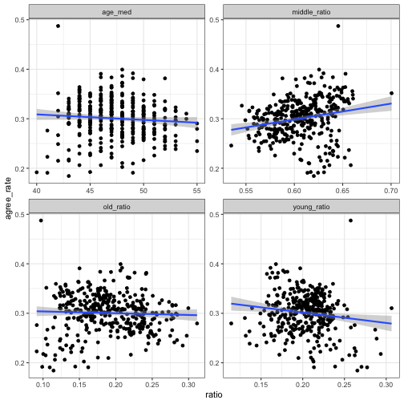
```

.small[
依照年齡拆成三組與同意率做散佈圖

- 年輕人 (18~30) 負相關 (r = -0.14)
- 中年人 (31-65) 正相關 (r = 0.21)
- 老年人 (65-) 無相關 (r = -0.04)
]
]


.pull-right[
- 過往文獻中年齡對於同性戀的態度也尚未有定論，且會與其他因素交雜在一起

- 我們都以為年紀較長者不容易接受婚姻平權，因此比較容易投不同意票。依據這次的模型結果，年齡中位數越高的地區
同意率較低 (當然還要考慮交互作用項，因此關係沒那麼簡單)

- 但如果我們沒有考量其他變項的因素，或者是換不同種的年齡變項的計算方式，結果有可能會大不相同
]

---

# 研究限制與改進方向

- 公投14案：同性婚姻納入民法 ≠ 同性戀態度

- 鄉鎮市區為每筆資料單位，但真的有代表性嗎


- 無法得之確切的投票人行為和態度


- 缺少一些可能的潛在變項 (宗教、家庭人數等)


- 離島 (界外值) 特別性質


- 假若我們有每個投票者的個人資料與行為，或許以後可以考慮使用 hierarchical linear model


